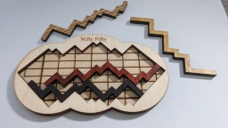
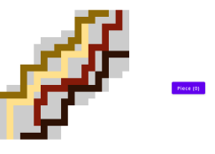
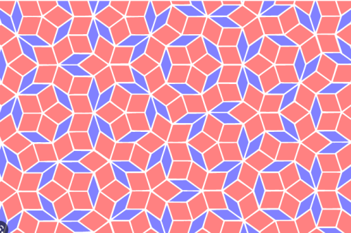
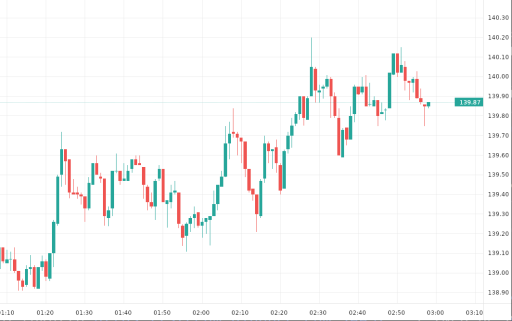

## Welcome to Haliwood Studios

This is where fun, small, interesting, or completely useless projects live.
Most of this stuff gets built in my free time or during live streams on Twitch. If you wanna check it out:

* [Halirutan on Twitch](https://www.twitch.tv/halirutan)

**A heads-up:** Everything here will eventually be public, but new repos start out visible only to
[my sponsors](https://github.com/sponsors/halirutan).
It's a little thank-you for their support while I'm getting things ready to share with everyone.

## What are we working on?

Right now this place is pretty empty, but I've got a bunch of ideas and honestly, the sky's the limit.
Here are some of the things I'm tinkering with that we could polish up and make worth sharing:

### Creating Optical Illusions

Using stable diffusion networks combined with different "control networks,"
we can create images that hide other images inside them.
By forcing certain conditions on the network during image creation, we get cool results.
One example is "Squint Images"—literally squint your eyes and a hidden image appears.

### Beautiful Collatz Graph Visualizations

The Collatz conjecture is about a sequence of integers with a super simple rule.
The big question (still unsolved in math!) is whether any sequence will eventually reach 1.
But honestly, the visual representation is just gorgeous.

### Solving Puzzles

I love solving puzzles.
Got this one for my birthday and couldn't crack it no matter how hard I tried.
So naturally, I wrote a program to solve it for me.

### Generating Beautiful Tilings

Making patterns and tilings is instructive, beautiful, and just plain fun.

### Price Charts using Kotlin

I wanted to see how hard it is to build a live price chart that updates in real time.
Used Kotlin Multiplatform to make a desktop app that does exactly that: 
it connects to the Binance API and can display price charts for any cryptocurrency.
While most apps like this rely on Electron, I wanted to see how performant you can make a desktop app
with Kotlin Multiplatform.

